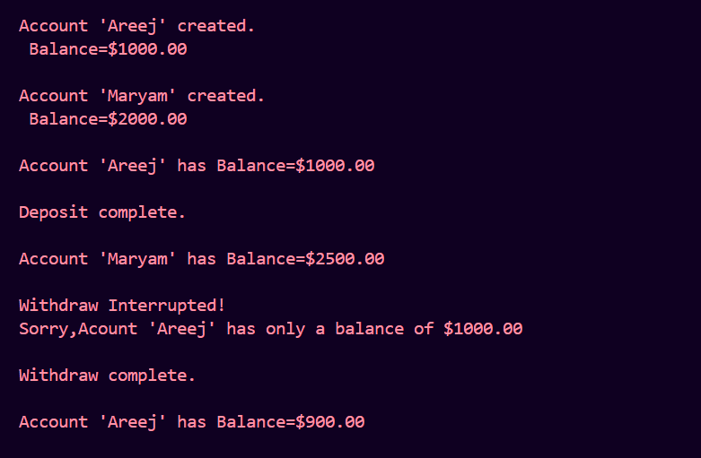
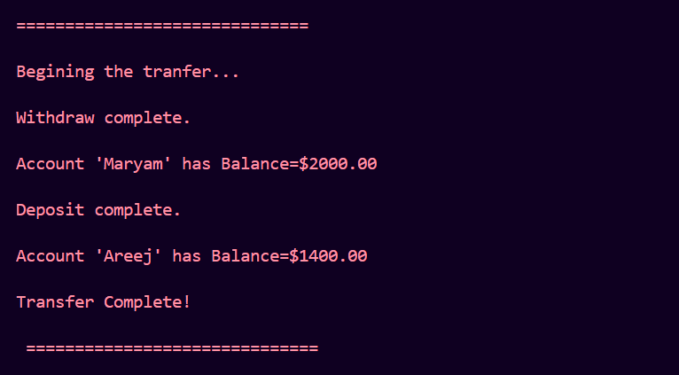
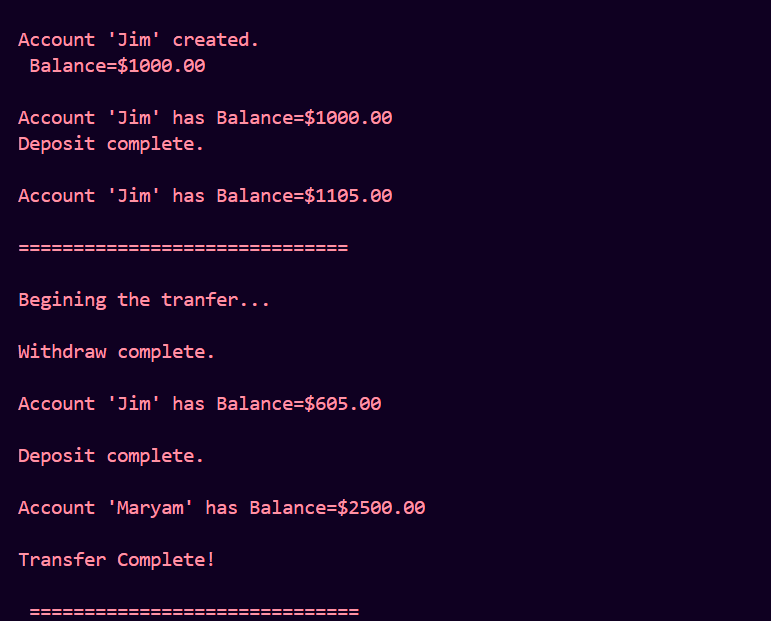

# Banking System OOP

Simple bank account management system in Python using OOP principles.

## Overview

This project demonstrates core Object-Oriented Programming concepts in Python — encapsulation, inheritance, and custom exception handling — through a simulated banking system. It supports creating accounts, depositing, withdrawing, and transferring funds between accounts, with built-in checks to prevent invalid transactions (e.g., withdrawing more than the available balance). It also includes a specialized account type that rewards deposits with bonus interest.

## Features

- Create bank accounts with an initial balance and account holder name
- Check account balance
- Deposit funds
- Withdraw funds (with balance validation)
- Transfer funds between two accounts
- Custom `BalanceException` for handling insufficient-funds errors gracefully
- `InterestRewardAcc` — a special account type that adds a 5% bonus on every deposit

## Project Structure

```
banking-system-oop/
├── bank_accounts.py    # BankAccount, BalanceException, InterestRewardAcc classes
├── main.py             # Entry point — creates accounts and runs example transactions
├── output_files/       # Screenshots of sample program output
└── README.md
```

## Requirements

- Python 3.x (no external libraries needed)

## How to Run

1. Clone the repository:
   ```
   git clone https://github.com/areej-builds/banking-system-oop.git
   cd banking-system-oop
   ```

2. Run the main script:
   ```
   python main.py
   ```

## Example Usage

```python
from bank_accounts import *

Areej = BankAccount(1000, "Areej")
Maryam = BankAccount(2000, "Maryam")

Areej.getbalance()
Maryam.deposit(500)

Areej.withdraw(10000)   # fails gracefully — insufficient balance
Areej.withdraw(100)

Maryam.transfer(Areej, 500)

Jim = InterestRewardAcc(1000, "Jim")
Jim.getbalance()
Jim.deposit(100)        # deposits with a 5% bonus
Jim.transfer(Maryam, 500)
```

## Sample Output

**Account creation, deposit, and withdraw (with insufficient balance handling):**



**Transfer between accounts:**



**InterestRewardAcc — deposit with bonus, then transfer:**



## Classes

### `BankAccount`
Base class representing a standard bank account.
- `getbalance()` — prints the current balance
- `deposit(amount)` — adds funds to the balance
- `withdraw(amount)` — removes funds, blocked if balance is insufficient
- `transfer(account, amount)` — withdraws from self and deposits into another `BankAccount` object

### `InterestRewardAcc` (inherits from `BankAccount`)
A reward account that overrides `deposit()` to add a 5% bonus on every deposit — e.g., depositing $100 adds $105 to the balance.

### `BalanceException`
Custom exception raised when a withdrawal or transfer is attempted with insufficient funds. Caught internally so the program doesn't crash — it prints a friendly error message instead.

## Concepts Demonstrated

- **Classes & Objects** — modeling real-world entities (bank accounts) as Python objects
- **Encapsulation** — balance and account logic bundled within the `BankAccount` class
- **Inheritance & Method Overriding** — `InterestRewardAcc` extends `BankAccount` and customizes `deposit()`
- **Custom Exceptions** — `BalanceException` for domain-specific error handling
- **Method Interaction** — `transfer()` reusing `withdraw()` and `deposit()` internally, and working polymorphically across account types

## Author

Areej